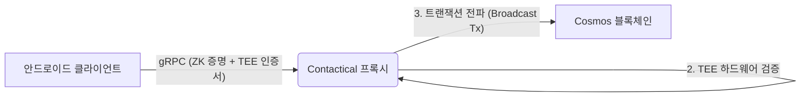

# Contactical 프록시 미들웨어 (Contactical Proxy Middleware)

**Contactical 프록시**는 Go 언어로 작성된 고성능 미들웨어 서버입니다. 이 서버는 **Contactical 안드로이드 클라이언트** (증명 제공자)와 **Contactical 블록체인** (Cosmos SDK) 사이를 연결하는 신뢰할 수 있는 가교(Bridge) 역할을 수행합니다.

이 서버의 주된 역할은 **영지식 증명(Groth16)** 및 **TEE(신뢰 실행 환경) 하드웨어 증명**을 오프체인(Off-chain)에서 검증하여, 오직 유효하고 시빌 공격(Sybil Attack)으로부터 안전한 노드만이 블록체인과 상호작용할 수 있도록 보장하는 것입니다.

---

## 🏗 아키텍처 (Architecture)



## 🚀 핵심 기능

### 1. 영지식 증명 검증 (신원 확인)

* **프로토콜:** Groth16 (고성능 `go-rapidsnark` 사용, 실패 시 `snarkjs`로 폴백).
* **기능:** 사용자의 실제 이메일이나 개인 식별 정보를 블록체인에 노출하지 않으면서, 유효한 Google ID Token(JWT)을 보유하고 있음을 검증합니다.
* **널리파이어(Nullifier) 추출:** 이중 등록 방지(시빌 저항성)를 위해 공개 신호(Public Signals)에서 널리파이어를 추출하여 체인에 전달합니다.

### 2. TEE 하드웨어 증명 (보안)

* **Android Keystore 검증:** 디바이스의 TEE(Trusted Execution Environment) 영역에서 생성된 인증서 체인을 검증합니다.
* **키 바인딩 (Key Binding):** 위치 데이터 서명에 사용되는 공개키가 소프트웨어가 아닌 하드웨어 보안 영역에 영구적으로 바인딩되어 있음을 보장합니다.

### 3. 하이브리드 위치 검증 (밀도 증명 - Proof of Density)

* **신호 분석:** 수신된 RSSI(신호 강도)와 GPS 좌표를 하버사인(Haversine) 공식을 이용해 교차 검증합니다.
* **스푸핑 방지:** 타임스탬프 조작(Time Drift) 및 물리적으로 불가능한 신호 대 거리 비율을 감지하여 가짜 위치 주장을 필터링합니다.

### 4. Cosmos SDK 통합

* 커스터마이징된 RPC 클라이언트 역할을 수행합니다.
* 검증된 노드를 대신하여 `MsgRegisterNode`, `MsgCreateClaim` 트랜잭션을 서명하고 Contactical 체인으로 전파합니다.

---

## 🛠 사전 요구사항 (Prerequisites)

* **Go** 1.21 이상
* **Node.js & npm** (`snarkjs` 폴백 검증기를 위해 필요)
* **Contactical 블록체인 노드** (로컬 또는 원격 실행 중일 것)

### 의존성 설치

1. **Go 의존성 설치:**
```bash
go mod tidy
```


2. **`snarkjs` 설치 (글로벌):**
*네이티브 Go 검증기에 문제가 발생할 경우를 대비한 폴백 검증 도구입니다.*
```bash
npm install -g snarkjs
```


---

## ⚙️ 환경 설정 (Configuration)

서버 설정은 `main.go` 파일 내 `Config` 구조체에 위치합니다. 시작하기 전에 다음 파일과 설정이 올바른지 확인하십시오.

| 설정 항목 | 값 (예시) | 설명 |
| --- | --- | --- |
| **verification_key.json** | `./verification_key.json` | Circom에서 내보낸 ZK 검증 키입니다. 반드시 클라이언트의 회로(Circuit)와 일치해야 합니다. |
| **NodeAddress** | `localhost:9090` | Cosmos 블록체인 노드의 gRPC 주소입니다. |
| **ChainID** | `contactical` | 연결할 Cosmos 네트워크의 체인 ID입니다. |
| **KeyName** | `alice` | 트랜잭션 수수료(Gas fee)를 대납할 로컬 키링의 계정 이름입니다. |

---

## ▶️ 서버 실행 (Running the Server)

1. **검증 키 배치:**
`verification_key.json` 파일(Circom 설정에서 추출)이 프로젝트 루트 디렉토리에 있는지 확인합니다.
2. **서버 시작:**
```bash
go run main.go
```


정상적으로 실행되면 다음과 같은 로그가 출력됩니다:
```text
🔎 [DEBUG] Verification Key Check 🔎
...
🔐 ZK Verification Key Loaded.
🚀 Contactical Proxy Started on :9095
```


---

## 📡 API 엔드포인트 (gRPC)

이 서버는 Cosmos SDK 모듈인 `x/reality`에 정의된 gRPC 인터페이스를 구현합니다.

### 1. `RegisterNode` (노드 등록)

* **입력:** ZK 증명(Proof), 공개 신호(Public Signals), TEE 인증서 체인, 디바이스 공개키.
* **처리 과정:** ZK 유효성 검증 -> TEE 하드웨어 검증 -> 온체인(On-chain) 노드 등록.

### 2. `CreateClaim` (데이터 제출)

* **입력:** GPS 좌표, RSSI 데이터, 페이로드 서명.
* **처리 과정:** ECDSA 서명 검증(TEE 키 사용) -> 위치 물리 법칙 검사 -> 밀도 증명(Proof of Density) 제출.

---

## 📂 프로젝트 구조

* `main.go`: 진입점, 환경 설정, gRPC 서버 초기화.
* `server` struct: ZK 검증 로직 및 Cosmos 트랜잭션 전파 로직 처리.
* `go.mod`: Go 모듈 의존성 관리 (Cosmos SDK, Rapidsnark 등).

---

## 🛡 보안 유의사항

* **운영 모드 (Production Mode):** 실제 운영 시에는 `Config` 구조체의 `IsDevMode`를 반드시 `false`로 설정해야 합니다. 그래야 강력한 ZK 및 TEE 검증이 강제됩니다.
* **키 관리:** 키링에 등록된 `alice` (또는 설정된 계정)는 Contactical 체인에 트랜잭션을 전송하기 위해 충분한 수수료(토큰)를 보유하고 있어야 합니다.

---

## 📜 라이선스

이 프로젝트는 MIT 라이선스 하에 배포됩니다.